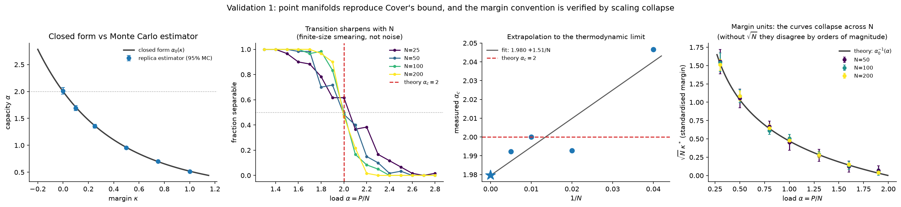
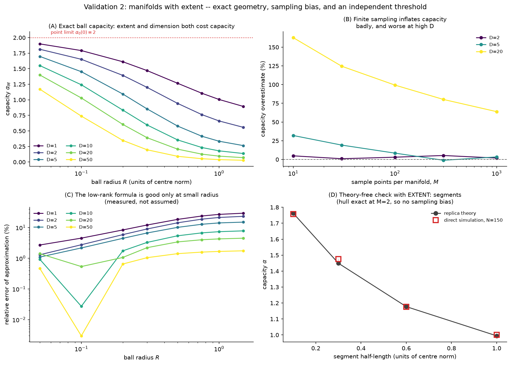
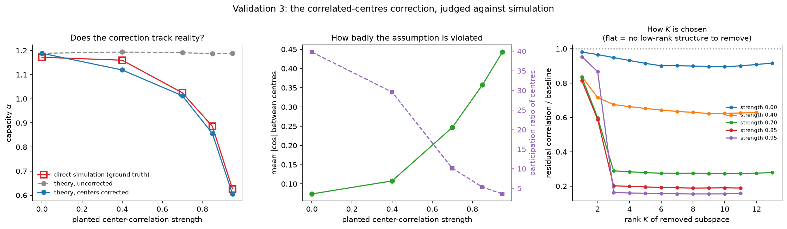

# manifold-capacity

A re-implementation of mean-field theoretic manifold analysis (MFTMA) from

> Chung, Lee & Sompolinsky, *Classification and Geometry of General Perceptual Manifolds*,
> [Phys. Rev. X 8, 031003 (2018)](https://doi.org/10.1103/PhysRevX.8.031003)
>
> Cohen, Chung, Lee & Sompolinsky, *Separability and geometry of object manifolds in deep neural
> networks*, [Nat. Commun. 11, 746 (2020)](https://doi.org/10.1038/s41467-020-14578-5)

written for learning and experimenting. It is not the authors' code and is not affiliated with
them. The reference implementation is
[schung039/neural_manifolds_replicaMFT](https://github.com/schung039/neural_manifolds_replicaMFT).

## Overview

Given P clouds of activation vectors, one per category, *manifold capacity* α = P/N is the
largest number of categories per dimension that a single linear readout can separate under
arbitrary labels. It decomposes into an anchor radius R_M and an anchor dimension D_M, which
describe the part of each manifold that the classifier sees. Isolated points give α = 2
(Cover 1965); manifolds with extent give less.

`mancap` computes α, R_M and D_M from raw activations, including the correlated-centers
correction of Cohen et al., using numpy and scipy.

## Differences from the reference implementation

- The inner minimisation is solved in its dual form, a nonnegative quadratic program whose Gram
  matrix does not depend on the Gaussian draw, with an active-set method. Results agree with the
  reference draw by draw to about 1e-12, and the solver is faster on CPU
  (`scripts/00b_benchmark_reference.py`).
- The correlated-centers correction uses a closed-form gradient and a self-contained Stiefel
  optimiser, so `cvxopt`, `autograd` and `pymanopt` are not required.
- Frames are reduced to the rank of the manifold offsets rather than to the number of samples,
  which removes a downward bias in D_M (a segment gives D_M = 1.00 rather than 0.81).
  `reduce_dim="qr"` reproduces the reference behaviour.
- The rank K of the center subspace is chosen by an elbow rule with an optional measured null,
  so uncorrelated centers give K = 0. `k_tol=0, min_reduction=0` reproduces the reference's
  argmin rule.
- `mancap.simulate` measures the separability threshold directly, without the replica formulas,
  so the theory can be compared with simulation.

## Validation

| Check | Result |
|---|---|
| Points: estimator vs closed form α₀(κ) | within Monte Carlo error |
| Points: direct simulation, extrapolated in 1/N | α_c = 1.98 (theory: 2) |
| Segments, half-length 0.1 / 0.3 / 0.6 / 1.0: theory | 1.763 / 1.449 / 1.177 / 0.994 |
| Segments: direct simulation | 1.758 / 1.475 / 1.177 / 1.000 |
| Correlated centers: mean error against simulation | 0.216 uncorrected, 0.024 corrected |
| Active set vs SLSQP; KKT conditions; gradient vs finite differences | agree to 1e-6 or better |

Two points relevant to applying the method to data:

- The theory's margin is standardised, κ_theory = √N · κ_measured. Without that factor, theory
  and simulation disagree by orders of magnitude at nonzero margin.
- Finite sampling inflates capacity: a manifold sampled with M points is seen as their convex
  hull. For a 20-dimensional ball, M = 1000 overestimates capacity by 64%. The trend in M should
  be reported rather than a single value.





## Setup

```bash
git clone https://github.com/shouvik-majumder/manifold-capacity.git
cd manifold-capacity
pip install -e ".[sim,plot,dev]"
pytest                                  # a few minutes
```

## Usage

```python
import numpy as np
import mancap

# Xs: one (N features, M samples) array per category
rng = np.random.default_rng(0)
Xs = [rng.standard_normal((50, 20)) * 0.1 + rng.standard_normal((50, 1)) for _ in range(10)]

frames = mancap.build_frames(Xs)
results = [mancap.analyze_manifold(f, rng=rng) for f in frames.frames]
print(mancap.combine(results), results[0].radius, results[0].dimension)
```

Validation scripts (each writes JSON to `data/` and a figure to `figures/`; `--quick` for a fast
run):

```bash
python scripts/01_validate_points.py
python scripts/02_validate_balls_and_segments.py
python scripts/03_validate_correlated_centers.py
```

`scripts/00_crosscheck_reference.py` compares against the reference implementation draw by draw;
it needs a separate environment, described in its docstring.

## Layout

```
mancap/inner.py      inner minimisation: dual active set, SLSQP, closed-form ball
mancap/capacity.py   α_M, R_M, D_M from the inner solutions
mancap/frames.py     raw activations to manifold frames; center-correlation diagnostics
mancap/centers.py    correlated-centers correction
mancap/simulate.py   direct simulation of the separability threshold
mancap/synth.py      synthetic manifolds with known geometry
mancap/analytic.py   closed forms and the margin convention
```

## Limitations

The replica result is a P, N → ∞ limit, and the correlated-centers correction has been validated
only at P ≈ 60, N ≈ 120 with a planted low-rank structure.

## License

MIT; see [LICENSE](LICENSE).
